## Coordinates

### Перехід між системами координат.  
Програма здійснює перехід із декартової системи координат у полярну і навпаки. Для декартових координат були задані точки з конкретними значеннями (x, y), і за допомогою функції з відповідними формулами здійснено перехід з декартової системи в полярну. Як результат - отримання значень для радіуса-відстані (r) та азимута (theta) для полярної системи координат. Далі вже з наявних значень (r, theta) здійснено перехід із полярної системи назад у декартову.

Двовимірний простір:

   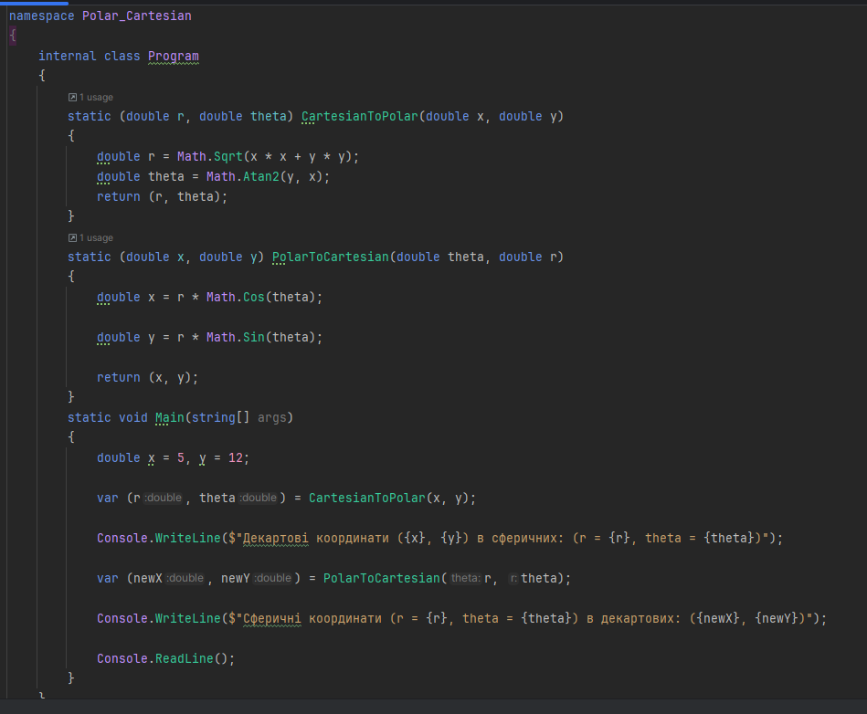

Результат

   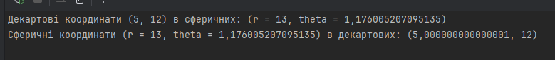
   
Тривимірний простір

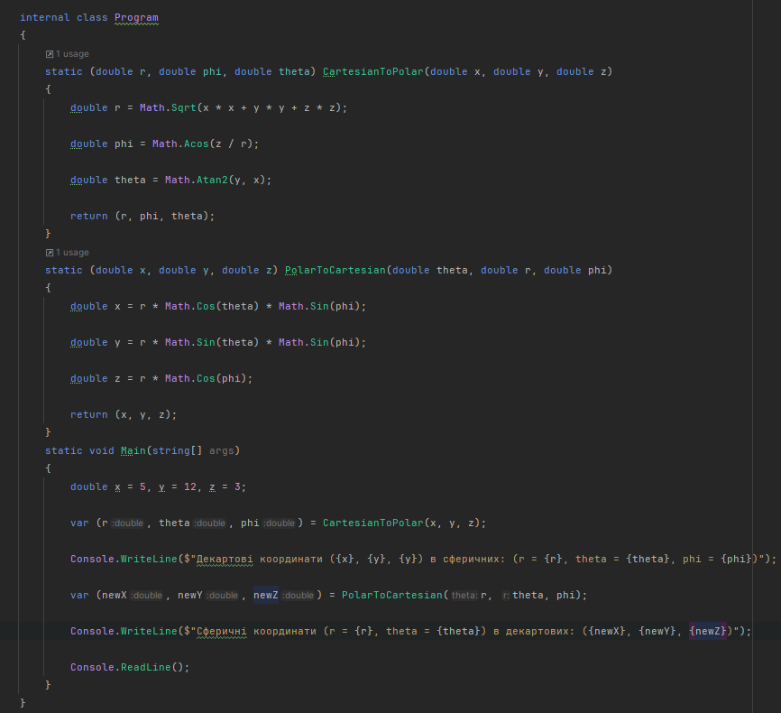

Результат
Було здійснено подвійне перетворення координат. Спочатку декартові координати точок були перетворені в сферичні за допомогою відповідних формул, що дозволило визначити радіус, азимутальний та полярний кути. Отримані сферичні координати були використані для зворотного перетворення у декартову систему, щоб перевірити коректність обчислень.

### Розрахунок відстаней у сферичній системі координат.

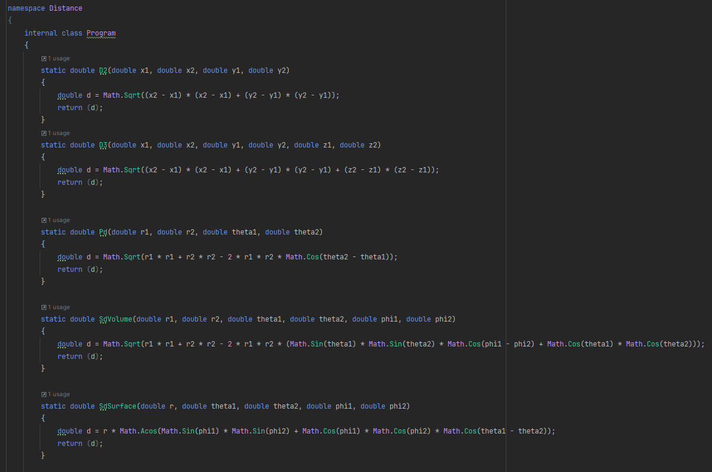

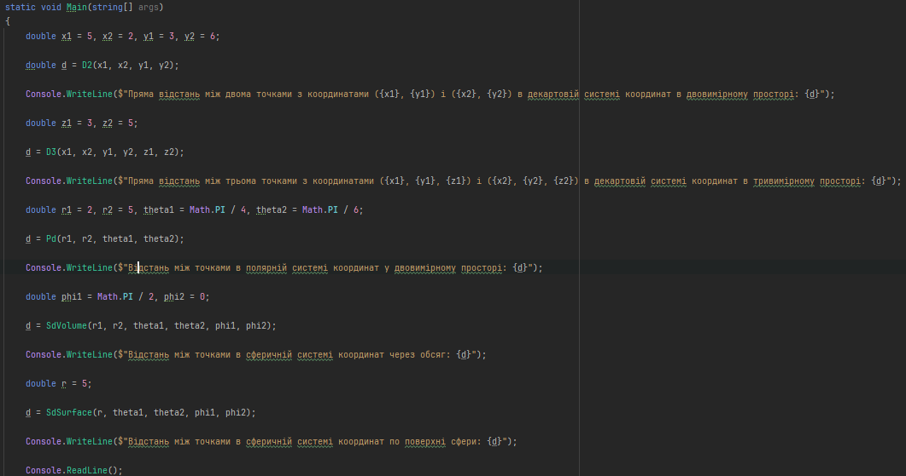

Програма реалізує функції для обчислення відстаней між точками в різних системах координат:
Декартова система:
d2: для двовимірного простору (x, y)
d3: для тривимірного простору (x, y, z)
Полярна система:
pd - для двовимірного простору, використовуючи радіуси (r) та азимути (θ).
Сферична система:
sd: для обчислення відстані через об'єм сфери, використовуючи радіуси (r), азимути (θ) та полярні кути (φ).
sd: для обчислення відстані по поверхні сфери, використовуючи радіус сфери (r), азимути (θ) та полярні кути (φ).

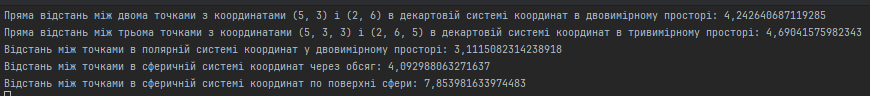

### Бенчмарки продуктивності

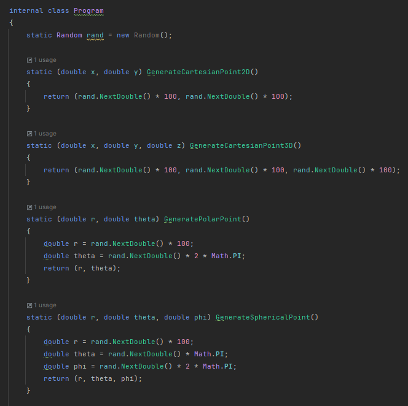

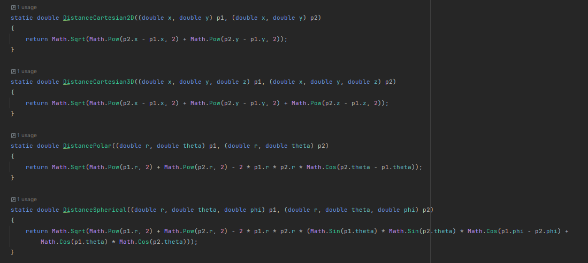

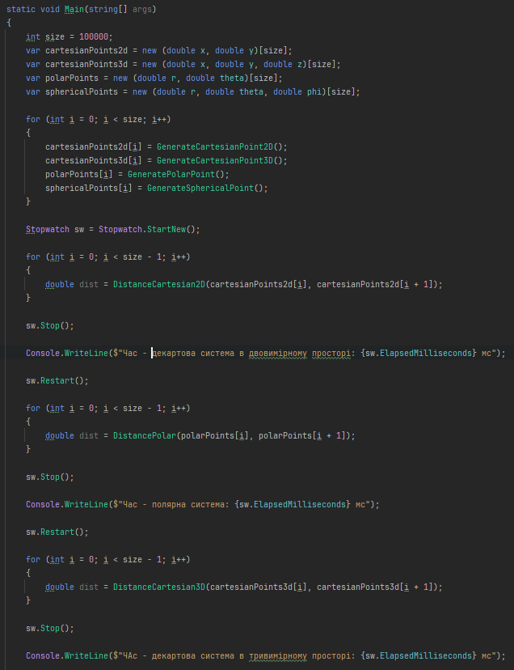

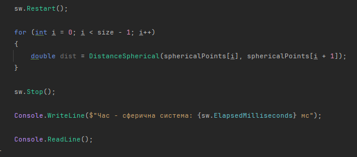

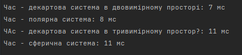

Програма генерує масиви координат для декартової (2D та 3D), полярної та сферичної систем координат. Потім вона послідовно обчислює відстані між сусідніми точками в кожному масиві, використовуючи відповідні формули. Для кожного типу обчислень вимірюється час виконання і виводиться результат.